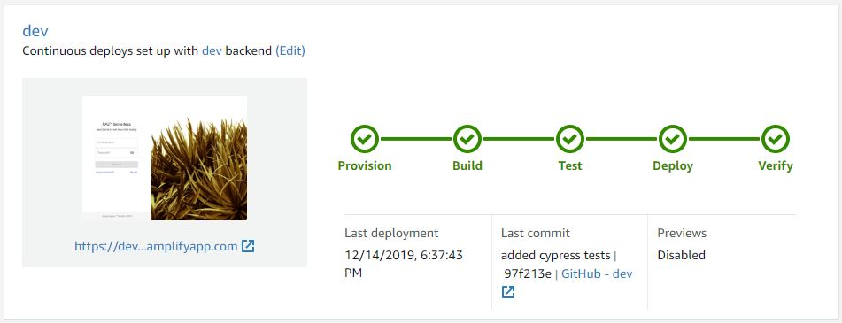

# RA2™ Serverless

## ra2-serverless full stack with ci/cd

### SaaS Starter Kit with React AWS Amplify

#### see live demo @ https://ra2-dev.sonabstudios.com/

test account: <br />
email: 'dev@sonabstudios.com' <br />
password: 'S0nabStudi0s#dev' <br />



# Features

### Auth module

- [x] signin with google
- [x] signin with facebook
- [x] signin with email
  - [x] signup with email
  - [x] signup confirmation
  - [x] reset password
- [x] aws hosted sign in (hidden)
- [x] signout

## PLANNED FEATURES

- [x] Version 1.0 : Authentication (email, google, facebook)
- [ ] Version 1.1 : User Profiles
- [ ] Version 1.2 : Multi-Factor Authentication
- [ ] Version 2.0 : Dynamic Themes (Light, Dark, Custom)
- [ ] Version 3.0 : Payment Integration (Paypal)

# Tech Stack

- TypeScript
- React (+ Hooks and Router)
- AWS Amplify
- Material-UI
- Unit Tests with Jest + Enzyme
- Functional Tests with Cypress
- CI/CD with Amplify Console

## Deploy with the AWS Amplify Console

The AWS Amplify Console provides hosting for fullstack serverless web apps. [Learn more](https://console.amplify.aws). Deploy this app to your AWS account with a single click:

[](https://console.aws.amazon.com/amplify/home#/deploy?repo=https://github.com/aws-samples/create-react-app-auth-amplify)

The Amplify Console will fork this repo in your GitHub account, and then build and deploy your backend and frontend in a single workflow. Your app will be available at `https://master.appid.amplifyapp.com`.

## Run locally with the Amplify CLI

1. Clone the repo that was just forked in your account

```
git clone git@github.com:<username>/create-react-app-auth-amplify.git

cd create-react-app-auth-amplify && npm install
```

2. Import the backend environment deployed by the Amplify Console to your repo (the `amplify/team-provider.json` file contains information on all backend environments in your AWS account). The GIF below shows how you to copy the `amplify env import` command from the Amplify Console.


3. Paste this command into your terminal at the root of your repo. You should see the `amplify/team-provider.json` updated with a backend named `amplify`.

```
amplify env import --name amplify --config "{<stack>}" --awsInfo "{<profile>}" --yes

Successfully added environment from your project
```

3. Initialize the Amplify CLI with the `amplify` environment.

```
amplify init
? Do you want to use an existing environment? Yes
? Choose the environment you would like to use: (Use arrow keys)
> amplify
```

4. Run locally

```
npm start
```

## Pull Requests to dev branch are welcome!
